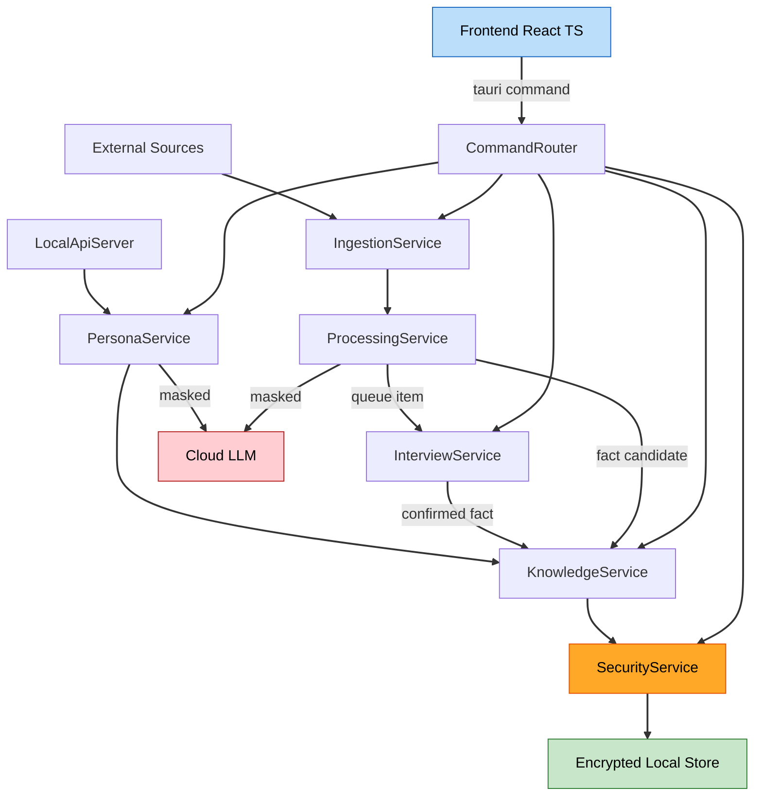

# Component Dependencies (knows-me)

> 의존성 매트릭스·통신 패턴·데이터 흐름. 통신은 **계층형 + 서비스 오케스트레이션**(프런트=명령/조회, 서비스=조율).

## 통신 패턴
- **Frontend ↔ Core**: Tauri command (동기 요청/응답 IPC). 프런트는 상태 비보유.
- **Service → Component**: 직접 함수 호출(동일 프로세스, Rust).
- **Scheduler → IngestionService**: 주기 tick 트리거(내부 타이머).
- **LocalApiServer → PersonaService**: 프로세스 내 위임(HTTP 진입점만 외부 표면).
- **Service → External(Notion/Gmail/LLM)**: HTTPS 클라이언트 호출(egress). LLM egress는 Masker 통과 필수.
- **모든 영속화 → SecurityService**: KeyHandle 기반 암호화 I/O 게이트.

## 의존성 매트릭스 (행이 열에 의존)
| ↓ 의존 \ 대상 → | Ingestion | Processing | Knowledge | Interview | Persona | Security |
|---|:--:|:--:|:--:|:--:|:--:|:--:|
| **CommandRouter** | ✔ | ✔(trigger) | ✔ | ✔ | ✔ | ✔ |
| **IngestionService** | — | ✔ | | | | ✔ |
| **ProcessingService** | | — | ✔ | ✔ | | ✔ |
| **KnowledgeService** | | | — | | | ✔ |
| **InterviewService** | | | ✔ | — | | ✔ |
| **PersonaService** | | ✔(Masker/LLM) | ✔ | | — | ✔ |
| **LocalApiServer** | | | | | ✔ | ✔ |
| **Scheduler** | ✔ | | | | | |

- 순환 의존 없음(단방향: Command → Service → Knowledge/Security). ProcessingService→InterviewService→KnowledgeService는 비순환.
- Security는 모든 서비스의 **저장 경로 게이트**(횡단 관심사)로만 의존됨.

## 데이터 흐름 (텍스트)
```
1) 수집:  Source(세션/Notion/Gmail/파일) --Connector.sync--> IngestionService
2) 가공:  IngestionService --RawItem--> ProcessingService
             --Masker.mask--> (masked) --LlmClient--> summary/labels   [+ TransferLog]
3) 분기:  확실 --FactCandidate--> KnowledgeService(upsert+history+index)
          불확실 --QueueItem--> InterviewService(QueueManager)
4) 인터뷰: Frontend --answer_item--> InterviewService --확정 Fact--> KnowledgeService
5) 조회:  Frontend --get_*/search--> KnowledgeService
6) 페르소나: Frontend/LocalApiServer --chat/draft--> PersonaService
             --context--> KnowledgeService ; --Masker+LLM--> reply/draft
7) 보안:  위 모든 저장/자격증명 I/O --> SecurityService(KeyManager/Vault)
```

## 데이터 흐름 (Mermaid)


## 경계·규칙
- **egress 최소화**: 외부로 나가는 경로는 (a) 커넥터 인증/동기화, (b) LLM 호출 두 곳뿐. LLM 경로는 Masker 필수.
- **확정 사실 단일 기록 경로**: KnowledgeService만 FactStore에 쓴다.
- **잠금 게이트**: SecurityService 미해제 시 저장/수집/조회 command 거부.
- **플러그형 확장**: 새 소스는 Connector trait 구현 추가만으로(다른 계층 무변경).
