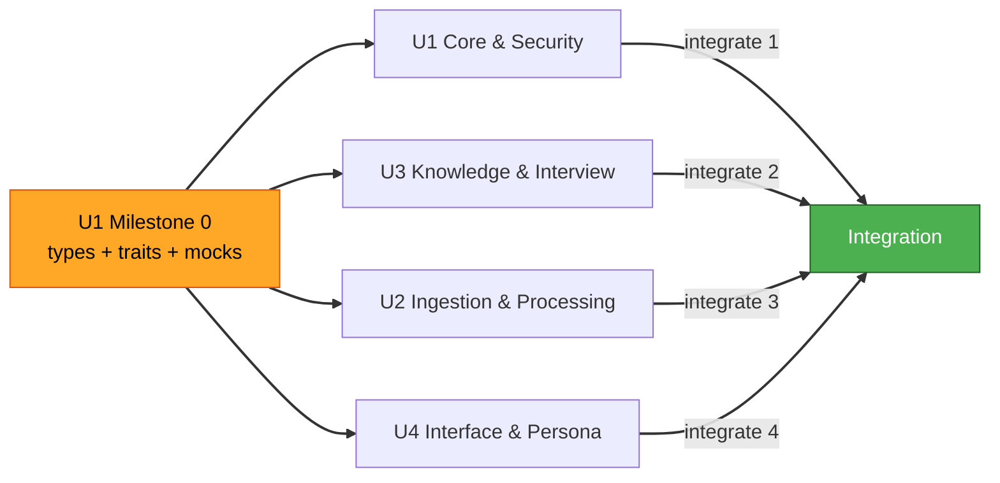

# Unit of Work — Dependencies (knows-me)

## 의존성 매트릭스 (행이 열에 의존)
| ↓ 의존 \ 대상 → | U1 Core/Security | U2 Ingestion/Processing | U3 Knowledge/Interview | U4 Interface/Persona |
|---|:--:|:--:|:--:|:--:|
| **U1 Core & Security** | — | | | |
| **U2 Ingestion & Processing** | ✔ (타입·crypto·Masker·LlmClient) | — | ✔ (Knowledge 쓰기·Interview enqueue) | |
| **U3 Knowledge & Interview** | ✔ (타입·EncryptedStore) | | — | |
| **U4 Interface & Persona** | ✔ (타입·Masker·LlmClient) | | ✔ (Knowledge 읽기) | — |

- **순환 없음**: U1 ← (U2,U3,U4), U3 ← (U2,U4). 단방향.
- U1은 모두의 기반(계약·crypto·LLM). U3는 U2·U4의 공통 데이터 의존.

## 통합 순서(Q2=A) vs 개발 순서(병렬)
- **개발(병렬)**: U1 Milestone 0 완료 즉시 U2·U3·U4 동시 진행(서로/자신 API를 mock).
- **통합(합류) 순서**: **U1 → U3 → U2 → U4**
  1. U1 실구현(타입·crypto·Masker·LlmClient·셸) 확정
  2. U3 실구현(Knowledge/Interview) 합류 → U2·U4의 mock 대체
  3. U2 합류(수집→가공→U3에 실제 기록)
  4. U4 합류(U3 실데이터 조회 + Persona)

## 계약(contract) 경계 — mock 대상
| 제공 Unit | 계약(trait/API) | 소비 Unit |
|---|---|---|
| U1 | 도메인 타입, `EncryptedStore`, `Masker`, `LlmClient`, 서비스 trait | U2, U3, U4 |
| U3 | `KnowledgeApi`(upsert/get/search/graph), `InterviewApi`(enqueue) | U2, U4 |

## 병렬 개발 다이어그램


### Text Alternative
```
Milestone 0 (U1 contracts+mocks) -> unblocks U1,U2,U3,U4 development in PARALLEL
Integration order: U1 -> U3 -> U2 -> U4
```

## 리스크 & 완화
- **U1 계약 변경 파급**: Dev A가 게이트키핑, 계약 버전 태깅, 변경 시 broadcast.
- **U3 공통 의존 병목**: U3의 API/mock을 Milestone 0 직후 최우선 확정.
- **mock ↔ 실구현 불일치**: 계약에 대한 공용 테스트(contract test) 공유.
