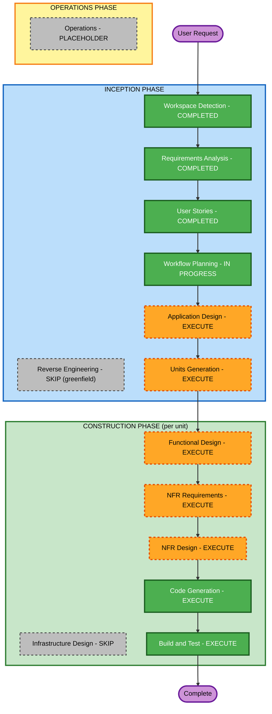

# Execution Plan (knows-me)

## Detailed Analysis Summary

### Change Impact Assessment
- **User-facing changes**: Yes — 다수 인터페이스(대시보드, 인터뷰 Queue, 미니홈피, 그래프, 페르소나 챗)
- **Structural changes**: Yes — 신규 시스템 전체(수집·가공·저장·Queue·서버·암호화 모듈)
- **Data model changes**: Yes — 사실(fact) 문서 모델, 메타데이터, 변경 이력, Queue 아이템, 페르소나 컨텍스트
- **API changes**: Yes — 로컬 페르소나 REST API, 외부 시스템(Notion/Gmail/LLM) 연동 인터페이스
- **NFR impact**: Yes — 프라이버시(마스킹), 로컬 암호화, 오프라인 저하, 성능, 테스트(PBT 부분)

### Risk Assessment
- **Risk Level**: Medium
  - 상승 요인: 시스템 전체 신규 구축, 프라이버시/암호화 민감성, 다수 외부 연동.
  - 완화 요인: Greenfield(기존 시스템 파괴 위험 없음), 개인 PoC, 롤백 용이(신규 커밋 되돌리기).
- **Rollback Complexity**: Easy (greenfield, 버전관리로 되돌림)
- **Testing Complexity**: Moderate (PBT 부분 적용: 직렬화·암복호화 왕복·마스킹 불변식)

## Workflow Visualization



### Text Alternative (always included)
```
INCEPTION
- Workspace Detection ....... COMPLETED
- Reverse Engineering ....... SKIP (greenfield)
- Requirements Analysis ..... COMPLETED
- User Stories .............. COMPLETED
- Workflow Planning ......... IN PROGRESS
- Application Design ........ EXECUTE
- Units Generation .......... EXECUTE
CONSTRUCTION (per unit)
- Functional Design ......... EXECUTE
- NFR Requirements .......... EXECUTE
- NFR Design ................ EXECUTE
- Infrastructure Design ..... SKIP (local desktop app, no cloud infra)
- Code Generation ........... EXECUTE (always)
- Build and Test ............ EXECUTE (always)
OPERATIONS
- Operations ................ PLACEHOLDER
```

## Phases to Execute

### 🔵 INCEPTION PHASE
- [x] Workspace Detection (COMPLETED)
- [x] Reverse Engineering (SKIPPED — greenfield, no existing code)
- [x] Requirements Analysis (COMPLETED)
- [x] User Stories (COMPLETED)
- [x] Execution Plan (IN PROGRESS)
- [ ] Application Design — **EXECUTE**
  - **Rationale**: 다수 신규 컴포넌트/서비스(소스 커넥터, 가공·마스킹 엔진, Knowledge DB, 인터뷰 Queue, 로컬 서버/페르소나, 암호화)와 그 경계·의존성을 정의해야 한다.
- [ ] Units Generation — **EXECUTE**
  - **Rationale**: 시스템이 커서 독립적으로 설계·구현 가능한 작업 단위(Unit)로 분해가 필요하다. 신규 데이터 모델·API·복잡 로직·다중 모듈에 해당.

### 🟢 CONSTRUCTION PHASE (Unit별 반복)
- [ ] Functional Design — **EXECUTE**
  - **Rationale**: 신규 데이터 모델(사실 문서/이력/Queue), 복잡 비즈니스 로직(마스킹, 확인형/심화형 인터뷰, 이력 관리)의 상세 설계 필요. PBT-01 속성 식별도 여기서 수행.
- [ ] NFR Requirements — **EXECUTE**
  - **Rationale**: 프라이버시/암호화/오프라인/성능 NFR 확정 및 기술 스택 선정(Tauri, PBT 프레임워크=Rust proptest / TS fast-check 등, 암호화 라이브러리, LLM API 클라이언트). PBT-09 프레임워크 선정 포함.
- [ ] NFR Design — **EXECUTE**
  - **Rationale**: NFR Requirements가 실행되므로 그 패턴(암호화 키 관리, 마스킹 파이프라인, 오프라인 저하)을 논리 컴포넌트에 반영.
- [ ] Infrastructure Design — **SKIP**
  - **Rationale**: 로컬 데스크탑 앱(Tauri)으로 클라우드 인프라 프로비저닝이 없다. 로컬 서버는 앱 내장, 외부 연동은 클라이언트 설정. 배포/패키징은 Build and Test에서 다룬다. (원격 배포는 향후 확장)
- [ ] Code Generation — **EXECUTE (ALWAYS)**
  - **Rationale**: Unit별 구현 계획 + 코드/테스트 생성. PBT-02/03/07/08 테스트 포함.
- [ ] Build and Test — **EXECUTE (ALWAYS)**
  - **Rationale**: 빌드·단위/통합 테스트·PBT 실행(시드 로깅) 및 검증.

### 🟡 OPERATIONS PHASE
- [ ] Operations — **PLACEHOLDER**
  - **Rationale**: 향후 배포/모니터링 워크플로우.

## Estimated Timeline
- **Total Stages to Execute (남은 것)**: Application Design, Units Generation, 그리고 Unit별 (Functional Design, NFR Requirements, NFR Design, Code Generation) × Unit 수 + Build and Test.
- **Estimated Duration**: Units 수에 따라 가변. Units Generation 이후 Unit별 반복으로 진행.

## Success Criteria
- **Primary Goal**: MVP(요구사항 §5.1)를 구현한 로컬 우선 Tauri 앱.
- **Key Deliverables**: 소스 수집(세션·Notion·Gmail·파일)·가공(마스킹)·Knowledge DB(위키)·인터뷰 Queue·인터페이스·페르소나 로컬 API·암호화.
- **Quality Gates**: 각 스토리 수용 기준 충족, PBT 부분 규칙(PBT-02/03/07/08/09) 통과, 마스킹으로 식별정보 미유출.
